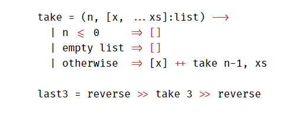

I feel pity for those who didn't get the header image's message :grin:

Anyways, continuing with the stuff that I am writing this for, the font.

You see, I am a big fan of Consolas as a Coding Font, and it got overtook.
Overtook by what? You might ask...

This new beast is called FiraCode and essentially, it is the same as Consolas (almost).

## How is it different?

Nice question. Let's answer that with what [**FiraCode**](https://github.com/tonsky/FiraCode) itself claims:

> Programmers use a lot of symbols, often encoded with several characters. For the human brain, sequences like ->, <= or := are single logical tokens, even if they take two or three characters on the screen. Your eye spends a non-zero amount of energy to scan, parse and join multiple characters into a single logical one. Ideally, all programming languages should be designed with full-fledged Unicode symbols for operators, but that’s not the case yet.

What FiraCode essentially does is combine symbols which take up multiple characters and **render** a single character in place of those.
The good thing is that it is just a rendering. Meaning that the actual code you write is totally ASCII-Compliant.

## This might sound like a sponsorship

If it is sounding like one, I am sorry but I have no intentions for making this seem like a sponsorship. I just happens to like something and want to share with the people why I like it and how I like it.

The thing with FiraCode is it is Consolas + Ligatures. Or in other words, elegance... The characters are so awesome, smooth looking and soothing that it really helps you focus on the code more than antyhing. At least for me that is the case.

However, my fate has decided that I not code for sometime. My laptop is still not working and it is my prime source for coding during nighttime which is my primetime... And so yeah stuff...

> I will soon update this thing with some pictures of Firacode in action.. (Couldn't do it because of the fact that I am somehow, in Safe Mode, trying to complete a blog post that I started to write from probably a week ago..)
> And about posting to GitHub, I will do that by logging-in in normal mode which has the possibility of crashing anytime and somehow upload it. Don't worry... If you are reading this, I was obviously successful!

> Update: Laptop has been back from repair, just finished getting all basic necessitites (required by me) set up. (ALMOST). More on my horrendous experience and stuff later in the next post. For now, enjoy this FiraCode Snippet:

 
<caption>:fire:aCode</caption>

You can check <a href="http://www.0x08.org/fonts/FiraCode/specimen.html" target="_blank">this</a> site out for a small static demo.

## Yeah this one is small

Blame my Laptop's problem for that, I can't concentrate on even the simplest posts, I had a huge TODO for the blog with some maintenance work and stuff.., You really lose inspiration to write a blog post if you started a long time ago and couldn't finish it when you were free...

Anyways, I apologize to anyone who is reading this. Stuff will get better, I promise (probably :P)

Have a nice day!
